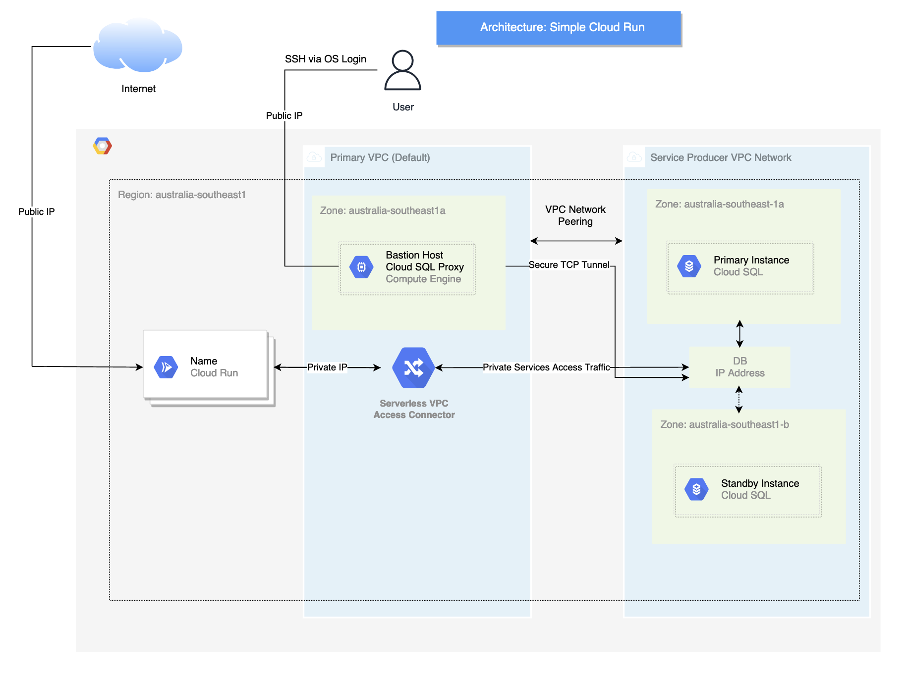

# The Servian GTD Technology Challenge
_By Praveen Muthuthanthirige_

A To-do/Get Tasks Done (GTD) application written in Golang deployed in Golang with hyper flexible scaling and High Availability (HA) in mind.

# Table of Contents
* [Background and Reasoning of the solution](#background-and-reasoning-of-the-solution)
    * [Security](#security)
    * [Application Deployments](#application-deployments)
    * [Selection](#selection)
* [Architecture](#architecture)
* [Prerequisites](#prerequisites)
* [Deployment Instructions](#deployment-instructions)
* [Known Issues](#known-issues)
* [Improvements](#improvements)

# Deployed Application:
https://gtd-app-dlz5eg5pta-ts.a.run.app


## Architecture


## Background and Reasoning of the Solution
Many considerations about architecture and the best methodologies to deploy this application in a highly available fashion have been delibrated. The following architecture deployments have thus been conceived as follows:

* Cloud Kubernetes (GKE, EKS, AKS)
* Auto Scaling Groups of VMs fronted by a LB
* Consolidated tooling solutions (AWS Amplify)/App Runner/App Engine
* Alt container orchestration technologies like Nomad
* Serverless solutions
    * Functions as a Service (FaaS), run per function invocation
    * Serverless Kubernetes (Cloud Run/KNative, Fargate)

The following solutions have been discarded as they do not meet the stipulated requirements of HA and flexible hyper scale.
 * Buckets

Indeed, the most common solution that strikes most decision makers is Kubernetes. After all, Kubernetes was used at Google for their production workloads, it has the ability to scale from nothing to planet wide and has the most development support among a myriad of other benefits.

However, as Donald Knuth once said, **"Premature optimisation is the root of all evil"** which cannot be more true when engineering a multi-tier application and its deployment. Therefore, I tend to focus on how we can best deliver value to client through the 3 aspects of _Simplicity_, _Security and Scalability_. 

## Selection
By looking through the lens of carefully balancing simplicity and customisability, **Serverless** was the clear choice. Development teams would rather focus on delivering features rather than dealing with the underlying infrastructure and I strongly believe that Serverless embodies the principles of DevOps. If this was a true greenfield project, Functions as a Service would allow for near-complete infrastructure abstraction, but as this is an already containerised application, Serverless Kubernetes was selected as the appropriate choice.

Google Cloud Platform truly represents the principles of containerisation with the most primitive infrastructure unit being a container (even in VMs!). It also views security not at the network edge but rather on the units of infrastructure itself, allowing for much granular rules and sound security practices. In addition, Google Kubernetes Engine (GKE) is built by the original contributors of Kubernetes itself, Google. This provides a strong foundation for clients to leverage Google philosophies and best practices within the platform. 

Above all, GCP's development workflows around their serverless offering is substantially cleaner than their competitors, distinctively in Continuous Deployment.

Due to these reasons, Cloud Run (or KNative under the hood) was selected. Cloud Run has the ability to connect to backing DBs and others, the ability to scale from minimal load to planet scale all without managing the Kubernetes worker and control plane! Unless there is already in-house expertise of handling Kubernetes clusters and specialised SRE, DB & DevOps teams, Cloud Run is handy for growing workloads. This application is very simple in nature as it's a golang app with a backing postgres DB making it a prime candidate for Cloud Run.

### Security
Security implications were also deeply considered in this deployment. The fortunate news is that Cloud Run has the ability to restrict Ingress to internal and most importantly, LBs. LBs were not included in this deployment due to time constraints, but can be attached through a serverless Network Endpoint Group (NEG). 

The LB itself can be attached with Cloud Armor for DDoS protections and mitigations for the top 10 OWASP vulnerabilities. 

All Cloud Run resources consist of IAM policies which restrict the access of external resources. By nature, Cloud Run resources only have access to access SQL, Compute and Artifact Registry (Google's Private Container Registry). All requests to unauthorised resources in GCP will be met with a 403 Forbidden. These IAMs are enacted strictly in this demo project.

External CI/CD Authentication has been conducted through Workload Identity Federation (WIF) enabling Keyless auth. It does this by translating short lived OIDC tokens into Google Security Tokens to authenticate as a service account to subsequently access authorised GCP resources. It completely removes all risks of long-lived JSON keys in accounts or commits. 

### Application Deployments

As Cloud Run fits in natively with DevOps principles, actual application deployments are invoked through CI/CD pipelines. I have chosen GitHub actions as the application is hosted on GitHub which makes it clean candidate for GitHub Actions.

A developer working on the project only need to push their code to the production repository which triggers a CD process of building the image, authenticating with GCP, pushing the image and invoking Cloud Run with the relevant flags.

## Prerequisites

Although this may be a bit controversial, I made the decision to only install a dependency until its well and truly indeed. Because of this, the only dependencies needed are:

* Terraform (tested on `v1.1.3`)
* gcloud (tested on `v368.0.0`)

## Deployment Instructions

> Forward Note:
> GitHub Action runs at the application level. Therefore, please visit: https://github.com/PraveenMut/TechChallengeApp for the CD workflow

A initaliation script has been provided in the scripts directory. Modify the script if desired (especially the bucket name as it **must** be globally unique to all GCP projects). To run, change directory to the scripts folder, and run `./init.sh`.

Ensure you are the *owner* of the organisation as Terraform should be run *locally*. Alternatively, ensure the appropriate IAM Roles of a user have been assigned (editor). This beyond the scope of the challenge. 

The script will then create:
* Create a project
* Link Billing
* Create a terraform service account
* Fetch its keys 
* Store it in .config. Please ensure that these are *not shared*. These are the keys to the kingdom.
* Assign IAM roles appropriate for the project
   * IAM Admin
   * Workload Identity Pool Admin
   * Artifact Registry Admin
   * Compute Admin
   * Network Admin
   * Storage Admin
   * Resource Admin
   * Service Account Token Creator
   * Service Account Admin
* Enable Google APIs
* Create a remote state bucket
* Initialise Terraform

Post initalisation, the person running the project can use the provided "convenience wrapper" `./terrawrapper.sh COMMAND` which injects all necessary variables necessary for a terraform plan, apply and output (all infrastructure mutating commands). The script prompts if you wish to run a backend command to fetch sensitive credentials (i.e. `gopass db/password` )

Post infrastructure application, you _may_ need to run the provided `bootstrap.sh` script in the bastion host. This will be in the `/tmp` directory (`/tmp/bootstrap.sh`). **Terraform should automatically run this step through Remote Exec**. However, it can fail. This is addressed in Known Issues.

This will install all dependencies and seed the database in the private subnet.

To access the bastion, the private key can be accessed through retrieving the raw JSON terraform output and redirecting the standard output to a formatted file. 

Steps to SSH into the bastion:
```bash
terraform output -json private_key_pem | jq .private_key_pem | xargs printf "%b\n" > .config/private_key.pem
ssh -i .config/private_key.pem  "$(terraform output unique_id | sed 's/\"//g')@$(terraform output host | sed 's/\"//g')"
```

### GitHub Actions Configuration

Fork the repo and provide GitHub secrets of VTT_DBUSER and VTT_PASSWORD.

Replace the `workload_identity_provider` and `service_account` key/values with the terraform output value in `.github/workflows/main.yaml`. Push the updated config and it should trigger the workflow.

## Known Issues

The configuration management of instances through Terraform's remote exec resources is **extremely fragile** and should **NOT** be used in production workloads. It can lead to tainted instance builds. In the interest of time, a sleep resource has been put into place which should allievate race conditions presented by a new instantiation of an instance (whereby the dependent packages such as golang or yum-utils aren't able to be accessed).

A better option is to integrate a workflow that executes a configuration management utility, such as Ansible, to ensure underlying configuration compliance with idempotency. A standard recommendation would be:
```
ansible/
    group_vars/
        all.yml
    host_vars/
        bastion.yml
    inventory/
        instances
    roles/
        common/
            tasks/
                main.yml
    site.yml
```

where site.yml would include:

```
- hosts: all
  roles:
    - common
```

This should be run as:
```
ansible-playbook -i inventory/instances site.yml --tags=<specific_task_tags>
```

But as creating thoroughly tested playbooks is another task in of itself, it will be a future improvement.

## Improvements

This is my first attempt at designing cloud architecture and implementing its underlying resources in GCP (my experience lies with on-premises infrastructure). Due to this there are multiple facets of improvements at this first iteration. The first set of improvements:

- Set up GitHub Actions webhook to automatically trigger a deployment after a successful terraform apply
- Set up an external LB to front the cloud run application
- Set up Cloud CDN to serve to the closest PoPs
- Set up Cloud Armor for additonal protection
- Set up High/low privilege service accounts for Terraform. One as a low privileged that impersonates a high privileged service account.
- Set up declarative configuration through YAML and inject it through GitHub Actions
- Set up terragrunt when infrastructure expands
- Research possible methods of first run app bootstrapping to avoid undertaking these in the bastion. A Helm-hook like service.
